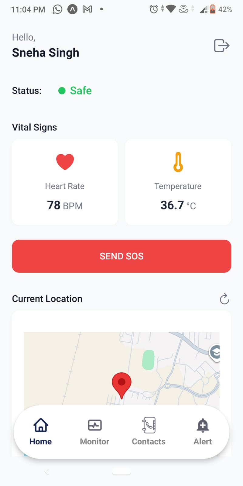
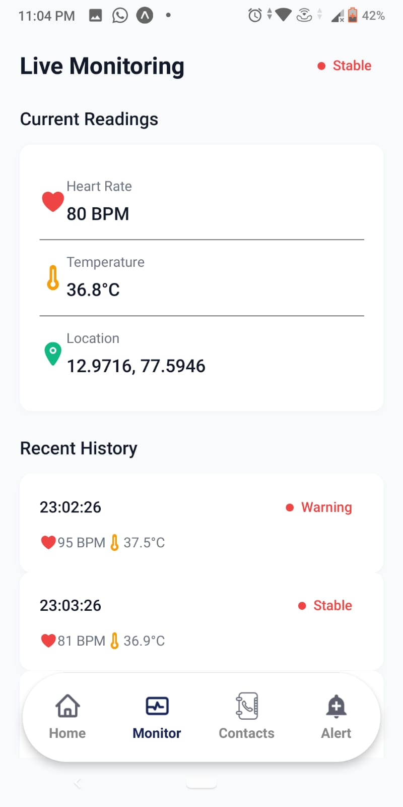
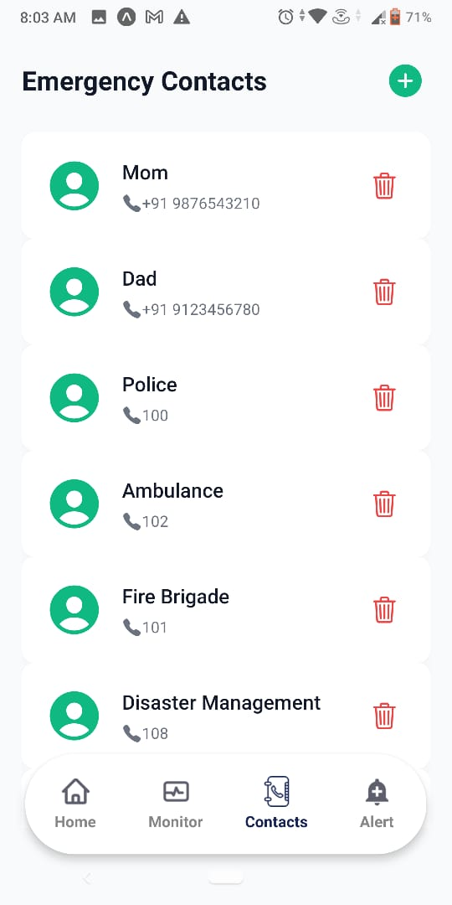
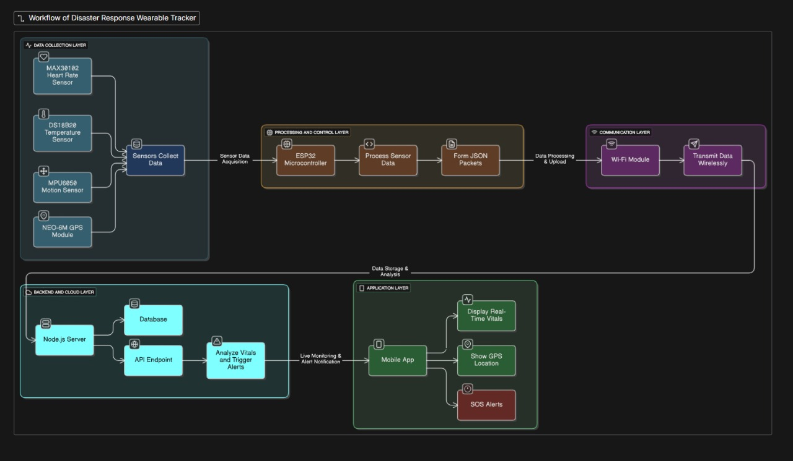

# WEARABLE TRACKER TO DETECT LOCATION & VITAL SIGNS OF VICTIMS DURING DISASTERS

A smart **wearable-based disaster response system** that continuously tracks the **real-time location** and **vital signs** (e.g., heart rate, SpO₂, body temperature) of victims during disasters and sends them to a **central monitoring dashboard** and **rescue team mobile app**.

The goal is to **reduce response time**, **prioritize critical victims**, and **improve coordination** between rescue teams and command centers.

---

## Problem Statement

During large-scale disasters (earthquakes, floods, building collapses, landslides, etc.):

- Victims may be **trapped** under debris or in inaccessible areas.
- Rescue teams **don’t know the exact location** of all victims.
- There is **no continuous monitoring** of victims’ health to prioritize the most critical cases.
- Manual coordination via phone or paper maps is **slow and error-prone**.

This project proposes a **wearable tracker + software system** to tackle these challenges.

---

## Objectives

- Track **real-time GPS location** of victims using a wearable device.
- Monitor **vital signs** such as:
  - Heart Rate (BPM)  
  - Blood Oxygen Level (SpO₂)  
  - Body Temperature  
- Send data periodically to a **backend server / cloud**.
- Display data on:
  - **Mobile App** (React Native) for rescue teams.
- Highlight **high-risk victims** using thresholds or alert rules.
- Work even in **low-network or intermittent connectivity** conditions (buffer + retry).

---

## System Architecture Overview

1. **Wearable Device (Hardware Layer)**  
   - Microcontroller (ESP32)  
   - Sensors:
     - Heart rate & SpO₂ sensor (MAX30102)
     - GPS module (Neo-6M)
   - Connectivity:
     - Wi-Fi  

2. **Communication Layer**
   - Protocols: HTTP / MQTT / WebSocket  
   - Data format: JSON  

3. **Backend Server**
   - Tech stack (example): **Node.js + Express + MongoDB**
   - Responsibilities:
     - Receive sensor data from wearable  
     - Store victim data and historical readings  
     - Expose REST APIs / WebSocket for frontend clients  
     - Trigger alerts based on thresholds (e.g., heart rate too low/high, SpO₂ < 90%)  

4. **Mobile Application (Rescue Team App) – React Native**
   - View victim list + their status (Normal / Warning / Critical)  
   - Show each victim’s **last known location on a map**  
   - View real-time vitals  
   - Search / filter victims (e.g., by severity, ID, location)    

5. **Control Room Web Dashboard**
   - Global view of all victims on a map  
   - Advanced analytics / history charts  
   - Role-based access for admins, coordinators, responders  

---

## Key Features

### Wearable Device

- Continuous sensing of:
  - Heart rate (BPM)
  - SpO₂ level
  - GPS coordinates (latitude, longitude)
- Configurable data sending interval (e.g., every 10–30 seconds).
- Low-power operation mode (depending on hardware).

### Backend

- Secure REST endpoints to:
  - Register victims / devices
  - Receive sensor data
  - Fetch latest vitals and location
- Stores historical sensor data for analysis.
- Alert engine:
  - Predefined thresholds (e.g., SpO₂ < 90 ⇒ Critical)
  - Marks each victim’s status: `NORMAL`, `WARNING`, `CRITICAL`.

### Mobile App (React Native)

- **Login / Authentication** (if implemented).
- **Victim List Screen**
  - Name / ID
  - Status badge (Normal / Warning / Critical)
  - Last update time
- **Victim Details Screen**
  - Real-time vitals
  - Location on map (e.g., using react-native-maps)
  - Trend charts (optional)
- **Map View**
  - Plots all victims on a map with color-coded markers by severity.
- **Alerts**
  - Highlights high-risk victims at the top.
  - (Optional) Push notifications for critical status.

---

## Tech Stack

### Hardware

- Microcontroller: *ESP32*
- Sensors:
  - GPS module (Neo-6M)
  - MAX30102 / similar pulse oximeter + heart-rate sensor
  - Temperature sensor
- Connectivity: Wi-Fi 

### Backend

- **Runtime**: Node.js  
- **Framework**: Express.js  
- **Database**:
  - MongoDB   
- **APIs**: REST (JSON) / WebSocket / MQTT bridge  
- **Auth**: JWT / Basic token (if implemented)

### Mobile App

- **Framework**: React Native  
- **State Management**: React hooks   
- **Networking**: Axios / Fetch  
- **Maps**: `react-native-maps` (Google Maps)  

---

App Screenshots

   
 
   

System Flow Diagram

  

